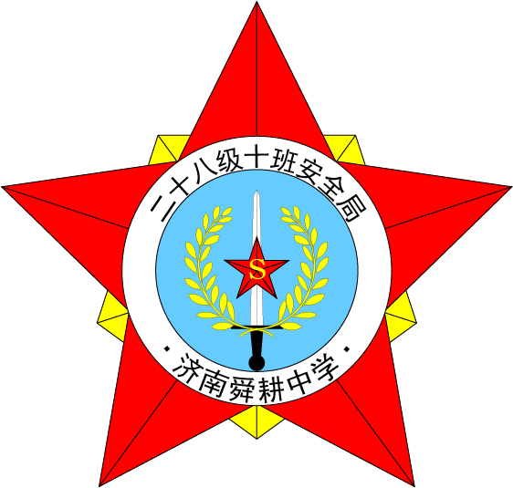
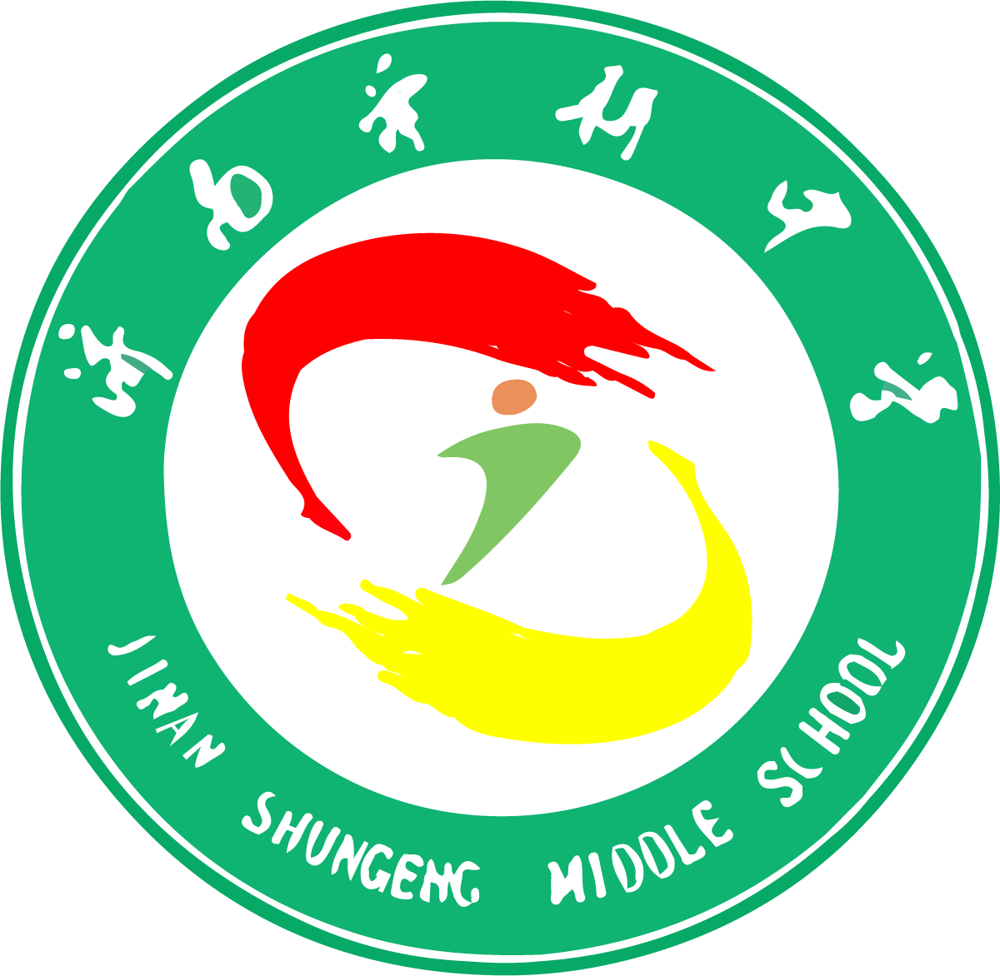
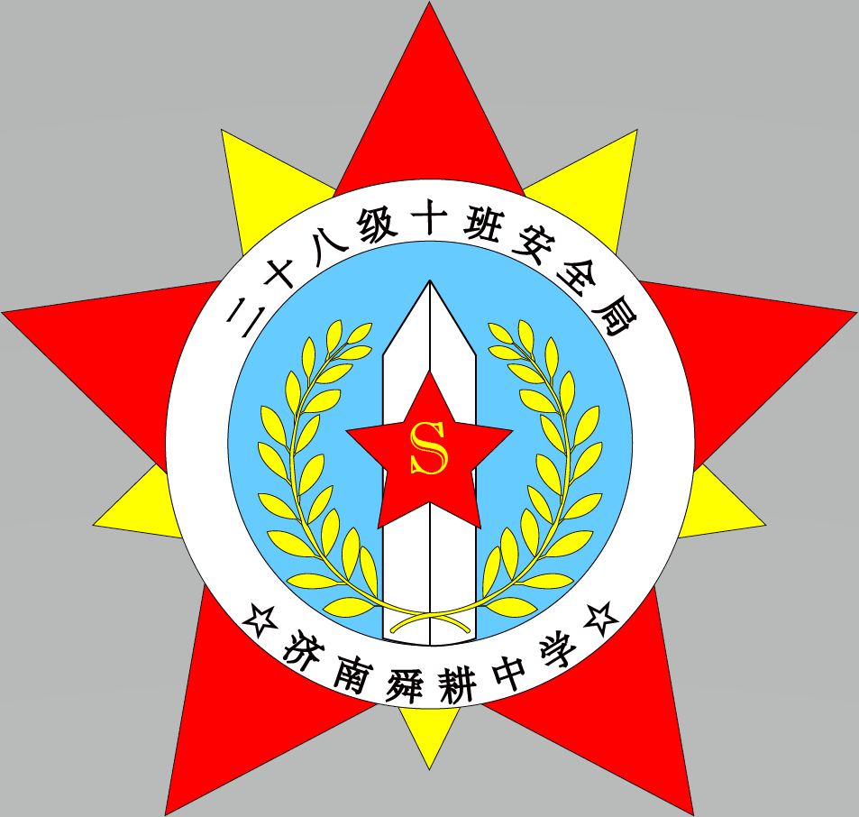

# 济南舜耕中学二十八级十班安全局

## 前言 安全局的成立

2020年的某一天，我收到了D君发来的一个压缩包。

​D君一直很能给我带来惊(zhěng)喜(huó)，这点我早就知道了。是的，道理我都懂，但是我没想到他居然做了一个网站！

我开始很疑惑，他到底什么时候偷学的网站制作呢？转念一想，信息课不是教授了FrontPage么？没想到他居然拿那个，结合课上所学的ps、word等软件，真的做出了一个网站！

这真的是太奇妙了。D君把这个网站命名为“二十八级十班安全局”​，这便是整个安全局官网的由来了。

二十八级十班是一个有温度的班集体。仍记得初一刚报道的那天，班主任王老师对我们说，初中的三年将是给我们留下印象最深的三年。小学虽然有六年，但是当时太小了，留下的的印象并不深；高中大家都忙着学习，恐怕也不会有太多交流。这句话我深以为然。我一直为初中毕业​没有纪念册而感到遗憾，直到21年1月，我把安全局官网挂到Github，开放了Github Pages，使得官网得以在互联网上被访问。安全局官网的出现，也算是弥补了这一遗憾吧。

致永远的二十八级十班安全局。

——YubaC，于2022年11月6日

## 考古 那个五月

> ### 那个五月
> 在2020年5月20日左右，我校查处了一起男女同学不正当交往事件。由于事发时学生刚复学不久，而且该事件中的男女同学不正当交往行为包含因防疫要求被学校禁止的未保持一米以上间距的行为，所以处理此事的有关教师在事发后于班主任群中进行了通报，要求各班班主任教育学生“不要早恋”和“遵守防疫制度”。 
> 班主任在班内进行了教育后，并没有达到理想中的效果，反而引发了“初中生能否早恋”的大讨论，这场大讨论在任峻铎“珊姐说得对”和“查找单身狗”的口号中结束。 
> ***
>> 相关史事：“单身狗”是一个网络俚语，特指没有恋爱对象的人，与“光棍”是近义词。同时，单身狗在词义上有自贬和自嘲的意味，带有诙谐的网络用语色彩。单身狗一词的流行是普遍的社会现象和网络时代的传播特色共同助推形成的。 
> ***
> 随后，任峻铎便成立了济南舜耕中学二十八级十班“查狗大队”，由其本人和王瑞琪担任大队长，杨清元担任中队长。“查狗大队”取代了原先的安全委员会，履行安全委员会的职责，同时也履行自身所谓的“查找单身狗，拆散早恋者”的职责。 
> 2020年5月23日左右，2020年济南市市中区第二次初中学业水平模拟考试成绩发布，潘睿欣的成绩高于杨清元的成绩。 
> 2020年5月25日上午第二个课间，潘睿欣和杨清元谈话时，潘睿欣提到了杨清元的成绩，并且开玩笑地表示“就你那成绩别和我说话”，杨清元针锋相对地表示“别让我抓住你早恋的把柄，否则明天就把你查了”，潘睿欣反驳“既然你是‘查狗大队’的，那么你有证件吗”，杨清元一时语塞，“败下阵来”。 
> 上午第三节课前，杨清元告诉其同桌朱梦扬自己没有证件的事实，朱梦扬当即表示可以帮他办一张。这张证件很是简单，是朱梦扬手写在便笺纸上的。在落款时，二人都觉得“查狗大队”这个名称太不正式了，于是便采用了“十班班安局”这个名称。 
> ——节选自《班级纪念册丛书-班级历史-九年级下册》，D君著

这便是安全局名称的由来。

## 历史 安全局官网的变迁

最早的官网页面很简单，排版也比较混乱（你甚至可以在每个网页上看到不一样的导航栏），随着一次又一次的维护与更新，逐渐被建设成了现在的模样。

这是官网很久以前用过的背景图片。

这是安全局最初的标志。

这是安全局早期曾用过的印章。

你现在仍然可以在一些网页里找到这些历史的痕迹，你可能已经发现了，一些网页仍然保留了早期的排版、和首页不一样的标题栏，比如[聚餐报备（20200727）](https://yubac.github.io/2810security.github.io/%E5%85%AC%E7%A4%BA%E6%A0%8F/%E8%81%9A%E9%A4%90%E6%8A%A5%E5%A4%8720200727/%E8%81%9A%E9%A4%90%E6%8A%A5%E5%A4%8720200727.htm)，以及[庆祝一个月前的班师回朝（20200812）](https://yubac.github.io/2810security.github.io/%E8%BF%91%E6%9C%9F%E4%BA%8B%E4%BB%B6/%E5%BA%86%E7%A5%9D%E4%B8%80%E4%B8%AA%E6%9C%88%E5%89%8D%E7%9A%84%E7%8F%AD%E5%B8%88%E5%9B%9E%E6%9C%9D/%E5%BA%86%E7%A5%9D%E4%B8%80%E4%B8%AA%E6%9C%88%E5%89%8D%E7%9A%84%E7%8F%AD%E5%B8%88%E5%9B%9E%E6%9C%9D.htm)。

一些比较早的图片里也使用了最初的安全局标志和印章，比如[二十八级十班安全局校外第一办事处成立（20200815）](https://yubac.github.io/2810security.github.io/%E8%BF%91%E6%9C%9F%E4%BA%8B%E4%BB%B6/%E7%AC%AC%E4%B8%80%E5%8A%9E%E4%BA%8B%E5%A4%84/%E7%AC%AC%E4%B8%80%E5%8A%9E%E4%BA%8B%E5%A4%84%E6%88%90%E7%AB%8B.htm)，以及[聚餐报备（20200727）](https://yubac.github.io/2810security.github.io/%E5%85%AC%E7%A4%BA%E6%A0%8F/%E8%81%9A%E9%A4%90%E6%8A%A5%E5%A4%8720200727/%E8%81%9A%E9%A4%90%E6%8A%A5%E5%A4%8720200727.htm)。

还有一些已经被停用了的图片，如：

## 相约 永远的二十八级十班安全局

告别了挚爱的老师同学，背起了打包的行囊，携带满心的祝福和美好回忆，我们踏上了未来的奇幻旅程。但随着时间的流逝，一些本来十分清晰的事物渐渐蒙上了阴影，变得模糊不清起来。

现在，是时候召集所有的二十八级十班安全局的干员了！

所有看到召集令的干员，均可以按照官网[监督举报](https://yubac.github.io/2810security.github.io/%E7%9B%91%E7%9D%A3%E4%B8%BE%E6%8A%A5/%E7%9B%91%E7%9D%A3%E4%B8%BE%E6%8A%A5.htm)页面提供的二十八级十班安全局的邮箱同我们联系。你也可以向我们发送邮件，以订阅我们的放假通知。

我们也欢迎各位干员向我们发送Pull Request以丰富安全局官网的内容，或是联系我们，以补全我们共同的回忆。

待到一切尘埃落定,剩下的,也只是对往昔的回忆。

但你若能从这个官网中得到一点慰藉与快乐，我们的存在便有了意义。

济南舜耕中学 二十八级十班安全局